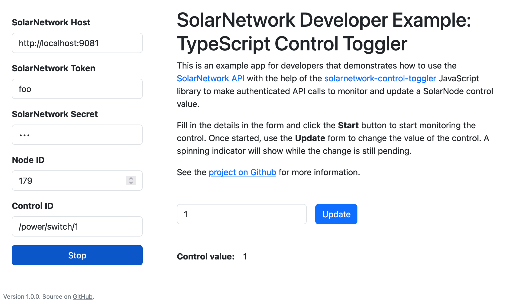

# SolarNetwork Example: TypeScript Control Toggler

This project is a little web app to show the basics of using the SolarNetwork API in a TypeScript
project to download large sets of datum stream data using the `ControlToggler` helper class.

You can see the example in action here:

<https://go.solarnetwork.net/dev/example/typescript-control-toggler/>



# Building from source

To build yourself, clone or download this repository. You need to have Node 18+ installed. Then:

```sh
# initialize dependencies
npm ci

# run development live server on http://localhost:8080
npm run dev

# build for production
npm run build
```

Running the `build` script will generate the application into the `dist/` directory.
